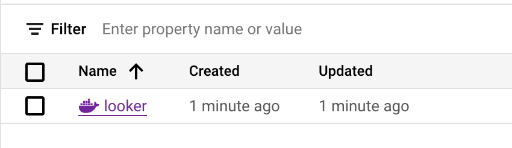

# Create Container Image

### Edit cloudbuild.yaml
* Navigate to looker_deployment/create_container_image/dockerfile/
* Find and replace below 2 variables with your values under substitution
  ```
  substitutions:
    _LOOKER_TECHNICAL_CONTACT_EMAIL: '<email>'
    _REGISTRY_PATH: '<registry-path>'
  ```
  * **_LOOKER_TECHNICAL_CONTACT_EMAIL**: make sure to use the same email that you used to accept the EULA when registering your license key.
  * **_REGISTRY_PATH**: This is the full path to your Looker Artifact registry. This was one of the output values from the GCP Project Terraform.
  
### Build Image
* Start the build for creating looker image and pushing to artifacts registry
  ```
  $ gcloud builds submit --config cloudbuild.yaml --substitutions=_LOOKER_VERSION="22.18"
  ```
* Verify pushed looker image
  
  