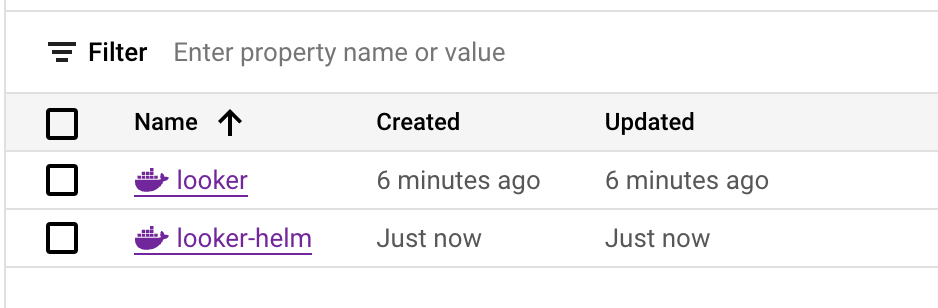

# Create Helm Chart

### Edit cloudbuild.yaml
* Navigate to looker_deployment/create_helm_chart/helm/
* As we did before, update the _REGISTRY_LOCATION value to your Artifact Registry’s region
  ```
  substitutions:
    _REGISTRY_LOCATION: "<region>"
  ```

### Build Helm Chart
* Build helm chart and push to artifact registry
  ```
  $ gcloud builds submit --config cloudbuild.yaml
  ```
* Verify pushed looker image
  
  