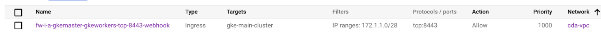

## Prerequisite  steps for Shared VPC Setup

- Create Project used for Shared VPC  (HOST_PROJECT_ID)
- Create Project used for the Service (PROJECT_ID)
- Prepare Env Variables:
  ```shell
  export HOST_PROJECT_ID=
  export PROJECT_ID=
  ```
- Run following scripts (will follow instructions as described [here](https://cloud.google.com/kubernetes-engine/docs/how-to/cluster-shared-vpc)).
  This will create `tier-1` and `tier-2` subnets inside `cda-vpc` network inside the VPC Host Project and grant access for the Service Project:
  ````shell
  gcloud config set project $PROJECT_ID
  bash -e setup/setup_vpc_host_project.sh
  bash -e setup/setup_vpc_service_project.sh
  ````

- Get the IAM policy for the tier-1 subnet:
  ```shell
  gcloud compute networks subnets get-iam-policy tier-1 \
     --project $HOST_PROJECT_ID \
     --region us-central1
  ```
  The output contains an ETAG field. Make a note of the etag value.
- Find out PROJECT_NUMBER of the Service Project:
  ```shell
  SERVICE_PROJECT_NUM=$(gcloud projects describe "$PROJECT_ID" --format='get(projectNumber)')
  ```
- Create a file named `tier-1-policy.yaml` that has the following content (Replace SERVICE_PROJECT_NUM below with the actual value and ETAG_STRING with ETAG tag):
  ```shell
  bindings:
  - members:
    - serviceAccount:SERVICE_PROJECT_NUM@cloudservices.gserviceaccount.com
    - serviceAccount:service-SERVICE_PROJECT_NUM@container-engine-robot.iam.gserviceaccount.com
    role: roles/compute.networkUser
  etag: ETAG_STRING
  ```
  
- Set the IAM policy for the tier-1 subnet:
  ```shell
  gcloud compute networks subnets set-iam-policy tier-1 \
      tier-1-policy.yaml \
      --project $HOST_PROJECT_ID \
      --region us-central1
  ```
- Reserve External **Regional** Static IP in the Service Project VPC. Should be same region as the GKE cluster (us-central1)


- Prepare `terraform/environments/dev/terraform.tfvars`
  ```shell
  cp terraform/environments/dev/terraform.sample.tfvars terraform/environments/dev/terraform.tfvars
  ```
  - Uncomment and fill in parameters for host_project (HOST_PROJECT_ID) and cda_external_ip (With reserved External IP)

- Follow the deployment instructions:
  ```shell
  export API_DOMAIN=mydomain.com
  export DOCAI_PROJECT_ID=
  ./init.sh
  ...
  ```

## Troubleshooting
Failure while deploying Ingress: 

```
│ Error: timed out waiting for the condition
│
│   with module.ingress.module.nginx-controller.helm_release.application,
│   on .terraform/modules/ingress.nginx-controller/main.tf line 1, in resource "helm_release" "application":
│    1: resource "helm_release" "application" {
│
```
Resolution:
- Make sure that external static IP address is Regional (not Global) and in the same region as GKE cluster
- Make sure that there is a firewall rule allowing Master Node communicate with the worker Nodes:
  - Ingress allowed for the network from MASTER_IPV4_CIDR on port 8443

> master-ipv4-cidr Specifies an internal IP address range for the control plane (For more details read about [private cluster](https://cloud.google.com/kubernetes-engine/docs/how-to/private-clusters).)
> 
In the example below, MASTER_IPV4_CIDR is 172.1.1.0/28
